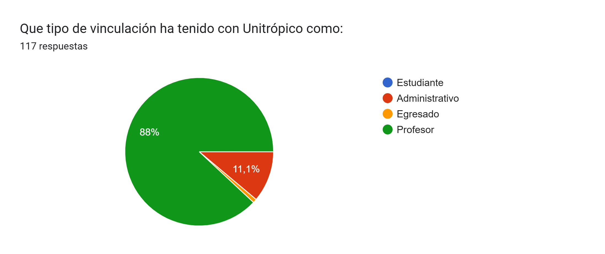

## **Identificación de brechas, fortalezas y oportunidades de mejora de la reforma del PEI**
### Identificación de brechas a considerar para la mejora de la reforma del PEI
### Identificación de fortalezas orientadas a la mejora de la reforma del PEI
### Identificación de oportunidades de mejora de la reforma del PEI

# Resultados de Instrumentos de consulta a los actores institucionales de Unitrópico

Los instrumentos deben estar diseñados para recolectar opiniones, percepciones y sugerencias de los diferentes estamentos de la Universidad (profesores, estudiantes, administrativos y egresados) y directivos con el propósito de asegurar la construcción colectiva y participativa del PEI, mediante estos instrumentos se busca que se garantice que todas las voces sean escuchadas y sus aportes sean tenidos en cuenta para la actualización del PEI. 

## Instrumento PEI, resultados de encuesta dirigida a Profesores

El instrumento aplicado a los profesores de UNITROPICO, se presentó en sesión de socialización realizada el 11 de junio de 2025. En esta sesión, se presentaron algunos lineamientos que guían la actualización del PEI, en particular, los aspectos alineados con la revisión de la misión y la visión de UNITROPICO. El instrumento comprende un cuestionario, disponible en google forms en el sitio: (https://docs.google.com/forms/d/e/1FAIpQLScCaSO8JXc5Brcx4ODwPU1yz58TGGZYux3Il_V6mVBiupoC9A/viewform?usp=dialog).

<!-- A la fecha de actualización de este reporte (Junio 15 de 2025), se han obtenido 78 respuestas. Los resultados obtenidos estan disponibles en: (https://docs.google.com/spreadsheets/d/1-7jP1MU0aXvSk0rLEN884Y2IwRpq7IKqCH9oUsmfzvU/edit?usp=sharing) -->

A la fecha de actualización de este reporte Julio 10 de 2025, se han obtenido 117 respuestas. Los resultados obtenidos estan disponibles en: (https://docs.google.com/spreadsheets/d/1-7jP1MU0aXvSk0rLEN884Y2IwRpq7IKqCH9oUsmfzvU/edit?usp=sharing)

### Resultados obtenidos

En el marco del proceso de actualización del Proyecto Educativo Institucional (PEI) de Unitrópico previsto para el periodo mayo–agosto de 2025, se ha diseñado un instrumento dirigido a los profesores de la comunidad académica con el propósito de recoger sus aportes, reflexiones y expectativas. Este cuestionario tiene como objetivo complementar el análisis institucional mediante la recopilación de experiencias, opiniones y propuestas vinculadas a la misión, el objetivo institucional y las funciones sustantivas de docencia, investigación y proyección social.

A través de una estrategia participativa, se busca identificar la percepcion del PEI y su relacion sobre las prácticas pedagógicas y las practicas de enseñanza o aprendizaje, desde la perspectiva profesoral. Lo anterior, con el proposito de establecr un diálogo colectivo para construir una versión actualizada del PEI, contextualizada y coherente con el contexto y desafios de Unitrópico.

La participación del % de los profesores vinculados en el primer semestre, ha sido importante para este ejercicio que representa un aporte para la cenceptualizacion de un proyecto académico inclusivo, pertinente y transformador, que responda a los objetivos y esafios actuales de la institucion.

El instrumento busca recolectar opiniones de los profesores, que permitan compartir visiones, experiencias y propuestas que enriquecerán el proceso de construcción colectiva del nuevo Proyecto Educativo Institucional.

### Ficha tecnica del instrumento

**Ficha técnica del instrumento aplicado a docentes – Actualización PEI Unitrópico (2025)**

> **Nombre del instrumento:** Cuestionario de consulta docente para la actualización del Proyecto Educativo Institucional (PEI) – Unitrópico 2025
>
> **Población objetivo:** Profesores vinculados a programas académicos de Unitrópico
>
> **Tamaño de la población estimada:** 280 docentes
>
> **Periodo de aplicación:** Mayo a agosto de 2025
>
> **Número total de respuestas obtenidas:** 117
>
> **Tasa de respuesta:** 41,79 %
>
> **Descripción del instrumento:**
> El cuestionario fue diseñado para recoger de los profesores vinculados en el primer semestre e 2025 a UNITROPICO, las percepciones, experiencias y propuestas de los docentes en torno a los componentes estructurales del PEI. Se compone de preguntas en torno a a relación del PEI con algunos de los siguientes ejes: entorno institucional, docencia, investigación, proyección social, bienestar e internacionalización.

## Resultados preliminares destacados

### Identificación institucional

El 100 % de los docentes encuestados manifestó identificarse parcialmente con los valores y principios del PEI. Sin embargo, la mayoría (70 %) considera que el documento es solo “parcialmente accesible”, y solo un 22,5 % lo percibe como “muy accesible y bien difundido”. La participación docente en la construcción del PEI ha sido limitada: 52,5 % no participó directamente aunque conoce el proceso, mientras que solo un 10 % tuvo una participación activa y continua. Esto evidencia la necesidad de fortalecer los mecanismos de apropiación institucional y de visibilizar el PEI entre los actores académicos.

### Función de docencia

Los docentes identifican valores clave promovidos por Unitrópico —como la responsabilidad, la honestidad y el compromiso social— como influyentes en su quehacer pedagógico. No obstante, también expresan que estos valores no siempre se traducen en acciones concretas en el aula. Existe una débil articulación entre el PEI y las estrategias pedagógicas, planes de estudio y metodologías activas. Se sugiere fortalecer la orientación del PEI hacia la formación integral, la evaluación pertinente y la contextualización curricular.

### Función de investigación

Aunque no se recogieron datos cuantitativos específicos, las respuestas abiertas permiten evidenciar barreras recurrentes como la escasez de recursos, la falta de incentivos institucionales y el tiempo limitado asignado para desarrollar investigación. Los docentes demandan mayor apoyo en términos de políticas claras, financiamiento y visibilización de resultados. La investigación debe ser concebida como un eje articulador del desarrollo territorial y la transformación social.

### Proyección social

Se percibe una desconexión entre la proyección social y la práctica docente. Muchos encuestados la asocian a actividades puntuales, sin integración sistemática con el currículo. Se identifica como prioridad que el PEI establezca una estrategia clara de proyección social que fomente el trabajo con comunidades locales, con enfoque diferencial, e integre estos procesos en la formación y evaluación estudiantil.

### Bienestar

Las respuestas reflejan preocupaciones en torno a las condiciones laborales, la carga académica y el acceso limitado a programas de bienestar y formación continua. Asimismo, los docentes manifiestan una percepción de baja participación en los procesos de gobernanza, lo cual limita su sentido de pertenencia. Se recomienda establecer canales efectivos de comunicación institucional y fomentar una cultura participativa más inclusiva.

### Internacionalización

Este eje aparece débilmente desarrollado. Aunque hay algunas iniciativas institucionales, los docentes perciben una baja apropiación del enfoque internacional. Se sugiere que el PEI defina una política integral de internacionalización que contemple movilidad, cooperación académica internacional, y formación en competencias globales, tanto para docentes como para estudiantes.

> **Resultados detallados**

# Principios UNITROPICO

## Definiciones incluidas en el PEI vigente

- **Accesibilidad:**  
  > “Es el principio que garantiza las condiciones de ingreso, permanencia y egreso de los estudiantes en la Universidad Internacional del Trópico Americano, a través del acceso efectivo a los servicios educativos, sin distinción de raza, religión, sexo, nacionalidad o condición social, económica, política o discapacidad, en igualdad de condiciones y oportunidades.”

- **Autonomía:**  
  > “Concebida como la capacidad de la Universidad para gobernarse por sí misma y para definir sus políticas académicas, administrativas y financieras, dentro del marco de la Constitución y la Ley.”

- **Corresponsabilidad:**  
  > “Implica el compromiso conjunto de los diferentes actores de la comunidad universitaria con la misión institucional y los procesos que contribuyen a su cumplimiento.”

- **Debido Proceso:**  
  > “Implica la garantía de los derechos y garantías de los miembros de la comunidad universitaria, en el marco del respeto por las normas y procedimientos establecidos por la Universidad.”

- **Economía:**  
  > “Hace referencia a la administración eficiente y eficaz de los recursos públicos destinados a la educación superior, bajo criterios de sostenibilidad financiera, austeridad y transparencia.”

- **Ética:**  
  > “Es el principio orientador del comportamiento de los miembros de la comunidad universitaria, en su actuación académica, administrativa e investigativa, con base en los valores institucionales.”

- **Excelencia Académica:**  
  > “Es el compromiso permanente con la calidad de los procesos formativos, investigativos y de proyección social que desarrolla la institución.”

- **Igualdad:**  
  > “Garantiza la equidad en el acceso, la permanencia y la graduación, así como en las condiciones laborales y académicas de todos los miembros de la comunidad universitaria.”

- **Integralidad:**  
  > “Implica la formación de seres humanos en todas sus dimensiones: cognitiva, emocional, social, ética y espiritual.”

- **Responsabilidad Pública:**  
  > “Compromiso institucional con la rendición de cuentas y la garantía del derecho a la educación superior como bien público.”

- **Libertad de Cátedra:**  
  > “Reconocimiento del derecho de los docentes a desarrollar sus actividades de enseñanza con autonomía pedagógica, en el marco del respeto a los valores institucionales.”

- **Pertinencia:**  
  > “Alineación de la oferta académica y de investigación con las necesidades del entorno local, regional y nacional.”

- **Regionalización:**  
  > “Compromiso con el desarrollo del territorio, mediante la formación de talento humano, la investigación y la proyección social contextualizadas.”

- **Sostenibilidad:**  
  > “Enfoque institucional orientado al equilibrio entre lo económico, lo social y lo ambiental, en todas sus actuaciones.”

- **Transparencia:**  
  > “Compromiso con la gestión clara, eficiente y abierta de los recursos, procesos y resultados institucionales.”

- **Trascendencia:**  
  > “Búsqueda de impacto positivo a largo plazo en la sociedad, a través de la formación de profesionales con sentido ético y compromiso social.”

- **Universalidad:**  
  > “Apertura a la diversidad cultural, ideológica y académica, en el marco de una educación inclusiva y democrática.”

- **Prevalencia de los Principios:**  
  > “Reconocimiento de la jerarquía normativa de los principios institucionales como fundamento de las decisiones y actuaciones universitarias.”

## Nota metodológica sobre la normalización de los datos

Los datos representados en la siguiente visualización corresponden a la percepción del profesorado sobre la **importancia relativa de 18 principios institucionales**. Para garantizar una comparación justa entre principios, los valores originales fueron **normalizados**. Esto implica que, para cada principio, se calcularon los porcentajes relativos de cada nivel de importancia (`5 Fundamental`, `4 Muy importante`, etc.), tomando en cuenta únicamente las respuestas válidas, **sin incluir valores faltantes o no respuestas**.

El proceso de normalización asegura que **la suma de los porcentajes para cada fila (principio) sea exactamente 100%**, facilitando así la lectura proporcional y comparativa de la importancia asignada por el profesorado.

## Análisis descriptivo de los resultados

- **Alta valoración**: Ética, Igualdad, Excelencia Académica y Prevalencia de los Principios son los principios más valorados como "Fundamentales" por el profesorado, superando el 75%.
- **Valoración media**: Integralidad, Libertad de cátedra, Transparencia y Universalidad también reciben una alta proporción de respuestas positivas.
- **Menor valoración relativa**: Autonomía, Economía, Corresponsabilidad y Regionalización reciben valoraciones más distribuidas o discretas.

## Gráfico 11.1 Resultados de la percepción de los profesores sobre la prioridad de los principios UNITROPICO 

```{r, echo=FALSE, message=FALSE, warning=FALSE}
library(ggplot2)
library(tidyr)
library(dplyr)
library(forcats)

# Datos
datos <- tribble(
  ~Principio, ~`5 Fundamental`, ~`4 Muy importante`, ~`3 Importante`, ~`2 Poco importante`, ~`1 Sin importancia`,
  "Accesibilidad", 19.66, 7.69, 3.42, 1.71, 0.85,
  "Autonomía", 17.09, 11.11, 3.42, 1.71, 0.85,
  "Corresponsabilidad", 18.80, 10.26, 2.56, 1.71, 0.85,
  "Debido Proceso", 20.51, 10.26, 0.00, 3.42, 0.00,
  "Economía", 16.24, 11.97, 4.27, 1.71, 0.00,
  "Ética", 28.21, 3.42, 0.85, 0.85, 0.85,
  "Excelencia Académica", 25.64, 5.13, 0.00, 1.71, 0.85,
  "Igualdad", 27.35, 1.71, 1.71, 0.85, 0.85,
  "Integralidad", 23.08, 6.84, 1.71, 0.85, 0.85,
  "Responsabilidad pública", 17.09, 10.26, 5.13, 0.85, 0.85,
  "Libertad de cátedra", 20.51, 9.40, 1.71, 0.85, 0.85,
  "Pertinencia", 19.66, 11.11, 1.71, 1.71, 0.00,
  "Regionalización", 17.09, 11.11, 3.42, 1.71, 0.85,
  "Sostenibilidad", 23.08, 8.55, 0.85, 0.85, 0.85,
  "Transparencia", 24.79, 5.98, 1.71, 0.85, 0.85,
  "Trascendencia", 18.80, 8.55, 4.27, 1.71, 0.00,
  "Universalidad", 23.08, 5.13, 1.71, 1.71, 1.71,
  "Prevalencia de los Principios", 25.64, 5.13, 1.71, 1.71, 0.00
)

# Normalizar para que sumen 100%
datos_normalizados <- datos %>%
  rowwise() %>%
  mutate(total = sum(c_across(`5 Fundamental`:`1 Sin importancia`))) %>%
  mutate(across(`5 Fundamental`:`1 Sin importancia`, ~ .x / total * 100)) %>%
  select(-total)

# Convertir a formato largo
datos_long <- datos_normalizados |>
  pivot_longer(cols = -Principio, names_to = "Importancia", values_to = "Porcentaje")

# Colores institucionales
colores_unitropico <- c(
  "5 Fundamental" = "#3A6351",
  "4 Muy importante" = "#61876E",
  "3 Importante" = "#A7C4A0",
  "2 Poco importante" = "#DDEAD2",
  "1 Sin importancia" = "#F2F1EB"
)

# Gráfico
ggplot(datos_long, aes(x = Porcentaje, y = fct_rev(Principio), fill = Importancia)) +
  geom_bar(stat = "identity", position = "stack") +
  scale_fill_manual(values = colores_unitropico) +
  labs(
    title = "Importancia asignada a los principios institucionales por el profesorado",
    x = "Porcentaje (%)",
    y = "Principio Institucional",
    fill = "Nivel de importancia"
  ) +
  geom_text(data = subset(datos_long, Importancia != "1 Sin importancia"),
            aes(label = sprintf("%.1f%%", Porcentaje)),
            position = position_stack(vjust = 0.5),
            size = 7 / .pt,
            color = "grey") +
  xlim(0, 100) +
  theme_minimal(base_size = 10)
```

## Tendencias de la educación superior

# Análisis descriptivo

El análisis de la percepción de prioridades del PEI revela una alta valoración de ciertos temas fundamentales. Entre ellos, **“Integración territorial Orinoquía”** se destaca con un 53% de prioridad alta, seguida por **“Garantía de calidad e inclusión”** (49.6%) y **“Educación para el desarrollo sostenible”** (48.7%). Esto sugiere un fuerte compromiso institucional con el desarrollo regional y la equidad educativa.

Asimismo, temas como **“Superación de brechas territoriales”**, **“Liderazgo académico”** y **“Financiamiento sostenible”** también son considerados estratégicos, con valores por encima del 40% en la categoría de prioridad alta. Por otro lado, áreas como **“Ética en IA”** y **“Apropiación social del conocimiento”** muestran un menor consenso en cuanto a su prioridad, siendo esta última la que mayor porcentaje de “Sin prioridad” recibe (13.7%).

Esto permite inferir que la comunidad académica considera prioritaria la articulación entre el territorio, la calidad educativa y el desarrollo sostenible, enmarcados en un enfoque de equidad. Las tecnologías emergentes y la apropiación del conocimiento, aunque reconocidas, aún requieren mayor sensibilización o posicionamiento estratégico dentro del PEI.

# Visualización de resultados

```{r}
# Cargar librerías
library(ggplot2)
library(dplyr)
library(tidyr)
library(forcats)

# Datos
datos_completos <- tribble(
  ~Tema, ~`Prioridad alta (%)`, ~`Prioridad estratégica o inmediata (%)`, ~`Prioridad media (%)`, ~`Baja prioridad (%)`, ~`Sin prioridad (%)`,
  "Garantía de calidad e inclusión", 49.6, 32.5, 12.8, 2.6, 2.6,
  "Formación y mercado laboral", 41.0, 27.4, 22.2, 5.1, 4.3,
  "Desigualdad de género", 44.4, 27.4, 16.2, 7.7, 4.3,
  "Educación para desarrollo sostenible", 48.7, 28.2, 17.9, 2.6, 2.6,
  "Programas académicos", 38.5, 38.5, 9.4, 3.4, 3.4,
  "Ética en IA", 22.2, 22.2, 29.9, 12.0, 5.1,
  "Transformación digital", 42.7, 23.1, 23.9, 6.0, 4.3,
  "Liderazgo académico", 43.6, 31.6, 16.2, 6.0, 2.6,
  "Educación y movilidad social", 41.9, 24.8, 25.6, 4.3, 2.6,
  "Gobernanza y mejora educativa", 37.6, 25.6, 25.6, 6.8, 4.3,
  "Financiamiento sostenible", 43.6, 27.4, 16.2, 6.8, 5.1,
  "Integración territorial Orinoquía", 53.0, 27.4, 12.8, 4.3, 2.6,
  "Superación de brechas territoriales", 47.9, 25.6, 19.7, 4.3, 2.6,
  "Apropiación social del conocimiento", 28.2, 28.2, 27.4, 2.6, 13.7
)

# Transformación
datos_largos <- datos_completos %>%
  pivot_longer(cols = -Tema, names_to = "Nivel", values_to = "Porcentaje") %>%
  mutate(Nivel = factor(Nivel, levels = c(
    "Prioridad alta (%)", "Prioridad estratégica o inmediata (%)", 
    "Prioridad media (%)", "Baja prioridad (%)", "Sin prioridad (%)"
  )))

# Ordenar temas por prioridad alta descendente
orden_temas <- datos_largos %>%
  filter(Nivel == "Prioridad alta (%)") %>%
  arrange(desc(Porcentaje)) %>%
  pull(Tema)

datos_largos <- datos_largos %>%
  mutate(Tema = factor(Tema, levels = orden_temas))

# Paleta de colores verdes (Unitrópico)
paleta <- c(
  "Prioridad alta (%)" = "#3A6351",
  "Prioridad estratégica o inmediata (%)" = "#61876E",
  "Prioridad media (%)" = "#A7C4A0",
  "Baja prioridad (%)" = "#DDEAD2",
  "Sin prioridad (%)" = "#F2F1EB"
)

# Graficar
ggplot(datos_largos, aes(x = Porcentaje, y = Tema, fill = Nivel)) +
  geom_bar(stat = "identity", position = "stack") +
  scale_fill_manual(values = paleta) +
  labs(
    title = "Percepción de prioridades del PEI por tendencias educativas",
    x = "Porcentaje (%)",
    y = "Tema",
    fill = "Nivel de prioridad"
  ) +
  theme_minimal(base_size = 13) +
  theme(legend.position = "right")
```

```{r}
# Cargar librerías
library(ggplot2)
library(dplyr)
library(tidyr)
library(forcats)

# Datos
datos_completos <- tribble(
  ~Tema, ~`Prioridad alta (%)`, ~`Prioridad estratégica o inmediata (%)`, ~`Prioridad media (%)`, ~`Baja prioridad (%)`, ~`Sin prioridad (%)`,
  "Garantía de calidad e inclusión", 49.6, 32.5, 12.8, 2.6, 2.6,
  "Formación y mercado laboral", 41.0, 27.4, 22.2, 5.1, 4.3,
  "Desigualdad de género", 44.4, 27.4, 16.2, 7.7, 4.3,
  "Educación para desarrollo sostenible", 48.7, 28.2, 17.9, 2.6, 2.6,
  "Programas académicos", 38.5, 38.5, 9.4, 3.4, 3.4,
  "Ética en IA", 22.2, 22.2, 29.9, 12.0, 5.1,
  "Transformación digital", 42.7, 23.1, 23.9, 6.0, 4.3,
  "Liderazgo académico", 43.6, 31.6, 16.2, 6.0, 2.6,
  "Educación y movilidad social", 41.9, 24.8, 25.6, 4.3, 2.6,
  "Gobernanza y mejora educativa", 37.6, 25.6, 25.6, 6.8, 4.3,
  "Financiamiento sostenible", 43.6, 27.4, 16.2, 6.8, 5.1,
  "Integración territorial Orinoquía", 53.0, 27.4, 12.8, 4.3, 2.6,
  "Superación de brechas territoriales", 47.9, 25.6, 19.7, 4.3, 2.6,
  "Apropiación social del conocimiento", 28.2, 28.2, 27.4, 2.6, 13.7
)

# Transformación
datos_largos <- datos_completos %>%
  pivot_longer(cols = -Tema, names_to = "Nivel", values_to = "Porcentaje") %>%
  mutate(Nivel = factor(Nivel, levels = c(
    "Prioridad alta (%)", "Prioridad estratégica o inmediata (%)", 
    "Prioridad media (%)", "Baja prioridad (%)", "Sin prioridad (%)"
  )))

# Ordenar temas por prioridad alta descendente
orden_temas <- datos_largos %>%
  filter(Nivel == "Prioridad alta (%)") %>%
  arrange(desc(Porcentaje)) %>%
  pull(Tema)

datos_largos <- datos_largos %>%
  mutate(Tema = factor(Tema, levels = orden_temas))

# Paleta de colores verdes (Unitrópico)
paleta <- c(
  "Prioridad alta (%)" = "#3A6351",
  "Prioridad estratégica o inmediata (%)" = "#61876E",
  "Prioridad media (%)" = "#A7C4A0",
  "Baja prioridad (%)" = "#DDEAD2",
  "Sin prioridad (%)" = "#F2F1EB"
)

# Graficar
ggplot(datos_largos, aes(x = Porcentaje, y = Tema, fill = Nivel)) +
  geom_bar(stat = "identity", position = "stack") +
  scale_fill_manual(values = paleta) +
  labs(
    title = "Percepción de prioridades del PEI por tendencia educativa",
    x = "Porcentaje (%)",
    y = "Tema",
    fill = "Nivel de prioridad"
  ) +
  theme_minimal(base_size = 13) +
  theme(legend.position = "right")
```

## Análisis descriptivo y proyecciones para el PEI

Los resultados evidencian la orientación del cuerpo docente hacia una visión integradora del PEI, articulada con la realidad regional y las tendencias globales. A continuación se presenta un análisis ampliado de las tendencias priorizadas y sus posibles implicaciones para la formulación y ajuste del PEI:

### Tendencias con mayor prioridad

- **Integración territorial Orinoquía (53%)** destaca como la tendencia más priorizada, lo cual reafirma el mandato misional regional de Unitrópico. Esta alta valoración debería traducirse en estrategias específicas de articulación con los actores del territorio, proyectos de investigación aplicada y planes de extensión adaptados a las necesidades de la Orinoquía.
- **Garantía de calidad e inclusión (49.6%)** y **Educación para el desarrollo sostenible (48.7%)** refuerzan la demanda por un enfoque educativo centrado en la equidad, accesibilidad y sostenibilidad. Esto demanda fortalecer mecanismos de aseguramiento de la calidad, políticas de admisión inclusivas y currículos que integren competencias para el desarrollo sostenible.

### Desafíos emergentes

- **Ética en inteligencia artificial** presenta baja prioridad alta (22.2%) y dispersión en las respuestas. Aunque no se percibe como prioritaria, su relevancia futura es innegable ante los avances tecnológicos. El PEI debería anticiparse e incorporar orientaciones éticas en sus políticas de innovación educativa y uso de tecnologías.
- **Apropiación social del conocimiento**, a pesar de su potencial transformador, obtiene 13.7% de respuestas que indican *“Sin prioridad”*. Esto sugiere un vacío de apropiación institucional o desconocimiento conceptual. El PEI podría incluir acciones de sensibilización y formación en este eje para ampliar su comprensión e implementación.

### Cohesión académica y pertinencia social

Temas como **Liderazgo académico (43.6%)**, **Formación y mercado laboral (41%)**, y **Educación y movilidad social (41.9%)** destacan la preocupación por la pertinencia de la formación y la empleabilidad. El PEI debe integrar políticas que fortalezcan la actualización docente, la formación continua, la inserción laboral de egresados y el seguimiento de trayectorias profesionales.

### Implicaciones para el PEI

1. **Jerarquización estratégica:** Los resultados permiten definir un orden de prioridades institucionales que pueden orientar los ejes estructurantes del nuevo PEI.
2. **Ajuste curricular:** Se hace necesario revisar los planes de estudio y programas académicos para responder mejor a los temas altamente valorados.
3. **Innovación con enfoque ético:** A pesar de su baja prioridad percibida, la ética en IA y la transformación digital deben ocupar un lugar estratégico como desafíos emergentes.
4. **Territorialización efectiva:** El énfasis en la región Orinoquía y en la superación de brechas territoriales debe reflejarse en una política institucional transversal.
5. **Educación transformadora:** Incorporar de manera transversal la sostenibilidad, la inclusión y la igualdad de género como principios rectores del PEI, reforzando su articulación con los principios institucionales y los ODS.

Este análisis proporciona una base para la toma de decisiones fundamentadas y orientadas al fortalecimiento de la misión de Unitrópico como universidad pública regional, pertinente y con vocación de transformación social.

----


# Instrumento PEI -  estudiantes
El instrumento aplicado a los estudiantes de UNITROPICO, se presentó en sesión de socialización realizada el 10 de junio de 2025. En esta sesión, se presentaron algunos lineamientos que guían la actualización del PEI, en particular, los aspectos alineados con la revisión de la misión y la visión de UNITROPICO y se invito a los estudiantes asistentes a diligenciar el formulario disponible en: ()

# Instrumento PEI -  administrativos

## Ficha técnica del instrumento aplicado a administrativos y directivos – PEI Unitrópico 2025

**Nombre del instrumento**: Cuestionario institucional para administrativos y directivos – Actualización del PEI

**Población objetivo**: Personal administrativo y directivo de Unitrópico

**Tamaño de la población estimada**: 95 personas

**Número de respuestas recibidas**: 28

**Tasa de respuesta**: 29,47 %

**Período de aplicación**: Mayo a julio de 2025

**Objetivo del instrumento**: Recoger las percepciones, niveles de apropiación, usos y proyecciones del Proyecto Educativo Institucional (PEI) desde la perspectiva del personal administrativo y directivo, con miras a su actualización y fortalecimiento en los procesos de gestión, planeación, bienestar, gobernanza y evaluación institucional.

------------------------------------------------------------------------

## Resultados preliminares destacados

### 1. Conocimiento y apropiación del PEI

-   El **46,4 %** de los encuestados afirmó conocer el PEI.
-   Un **35,7 %** ha tenido acceso a información básica y desea profundizar.
-   Un **17,9 %** indicó haberlo escuchado mencionar, sin conocerlo en detalle.

Este patrón indica un nivel aceptable de reconocimiento institucional, aunque persiste la necesidad de **estrategias de formación continua**, cápsulas informativas internas, y mecanismos de actualización permanente para fortalecer la apropiación funcional del PEI.

------------------------------------------------------------------------

### 2. Aplicación del PEI en las funciones administrativas

El análisis cualitativo de las respuestas abiertas permite identificar varias formas en que los encuestados manifiestan la aplicación del PEI en sus tareas diarias:

-   **Alineación con los valores institucionales**: como la responsabilidad social, la calidad, la inclusión y la equidad.
-   **Soporte a procesos misionales**: como la gestión de admisiones, movilidad académica, atención al usuario, proyección social y gestión de calidad.
-   **Vinculación con la planeación**: desarrollo de planes, seguimiento de indicadores, implementación del Sistema Integrado de Gestión.
-   **Fomento del trabajo colaborativo e identidad institucional**: fortalecimiento de la cultura de servicio y cohesión interna.

Estas respuestas fueron altamente representativas, con cada afirmación apareciendo con una frecuencia equivalente al 3,6 % del total (28 respuestas distribuidas equitativamente).

------------------------------------------------------------------------

### 3. Misión, visión y propósito institucional

Las respuestas indican que si bien los elementos fundacionales del PEI son conocidos, se sugiere:

-   Modernizar su **lenguaje**, haciéndolo más cercano y operativo.
-   Articular mejor la **visión institucional** con los retos contemporáneos de sostenibilidad, digitalización y desarrollo regional.
-   Utilizar la misión como marco evaluativo y no solo como referente simbólico.

------------------------------------------------------------------------

### 4. Bienestar y condiciones laborales

Aunque no fue una categoría explícita del instrumento, emergen valoraciones implícitas en las respuestas sobre:

-   La **necesidad de formación continua** para el personal administrativo.
-   El reconocimiento del **trabajo colaborativo como principio estructurante**.
-   La importancia de mantener un ambiente organizacional **alineado con los valores institucionales**.

------------------------------------------------------------------------

### 5. Planeación y aseguramiento de la calidad

Desde funciones como Planeación, Aseguramiento de la Calidad y Sistemas de Información, los participantes destacaron que el PEI:

-   Sirve como **guía estructural** en procesos de autoevaluación, acreditación y mejora continua.
-   Debería estar más presente en las herramientas de planeación operativa.
-   Se percibe como un elemento **transversal, pero poco monitoreado sistemáticamente**.

------------------------------------------------------------------------

### 6. Reconocimiento institucional del PEI

El PEI es percibido como un instrumento institucional importante pero poco consultado para la toma de decisiones estratégicas en lo cotidiano.

-   Se recomienda que su actualización incluya una **ruta de participación real**, vinculante y sostenida.
-   Se destaca la necesidad de mecanismos **formales de escucha activa**, diálogo horizontal y participación efectiva del personal administrativo en la planeación.


------------------------------------------------------------------------
## Instrumento PEI -  egresados

Los resultados de las consultas deben ser sistematizados y analizados de forma cuantitativa y cualitativa, el análisis debe identificar patrones comunes, así como las áreas de consenso y discenso y sera la base para las recomendaciones sobre los puntos de actualización del PEI.

## Resultados de aplicación de instrumentos PEI -  Profesores

A contiuación se presenta el informe con los resultados obtenidos en la aplicación del instrumento dirigido a docentes, actualizado a la fecha de entrega de este informe:


## ¿Qué tipo de vinculación ha tenido con Unitrópico?

La pregunta "¿Qué tipo de vinculación ha tenido con Unitrópico?" permitió identificar el perfil institucional predominante entre las **117 respuestas** obtenidas. De acuerdo con los resultados, la mayoría significativa de los encuestados corresponde a **profesores**, quienes representan el **88%** del total. Por otro lado, el personal **administrativo** constituye el **11,1%**, mientras que la participación de **egresados** es marginal, y no se registró ninguna respuesta por parte de **estudiantes**.

Esta distribución evidencia una participación altamente concentrada en el cuerpo docente, sugiriendo la importancia y relevancia que este grupo atribuye al proceso de evaluación del **Proyecto Educativo Institucional (PEI)**. Al mismo tiempo, el bajo índice de respuestas de administrativos, egresados y estudiantes señala la necesidad de fortalecer los mecanismos de divulgación y motivación hacia estos sectores, con el fin de asegurar una representatividad más amplia en futuros ejercicios de evaluación institucional.




## Percepción de los docentes sobre las tendencias de la educación superior


Pregunta abierta, a analizar
Pregunta abierta a cruzar con la evaluación de las tendencias que consideran mas relevantes
Un analisis a partir de los resultados
Una tabla de respuestas, en terminos de tamano del color para la grafica, eso nos da una imagen de conjunto

Esto puede orientar la construccion del reporte de desafios de la educacion superior
la construccion de los aspectos curriculares
el analisis de los documentos curriculares

**Pregunta 11**


> Analisis de preguntas abiertas

**Pregunta 12**


> Analisis de preguntas abiertas

**Pregunta 13**


 > Analisis de preguntas abiertas

**Pregunta 14**

14 ¿Cómo percibe el compromiso social del PEI con el territorio y su impacto en su actividad como profesor de Unitrópico?


**Pregunta 15**

15 ¿Cuál ha sido su experiencia o participación en actividades o proyectos de proyección social o comunitaria como docente Unitrópico?


> Analisis de pregunta abierta

**Pregunta 15.1**

15.a   Podría mencionar una iniciativa relacionada con su actividad docente, que sea relevante promover o mantener en términos de proyección social? 


> Analisis de pregunta abierta

**Pregunta 16**

16   En su rol como profesor en Unitrópico,   ¿Qué dimensión o aspecto debería incluirse o fortalecerse con prioridad en el PEI ? en materia de Proyección social


> Analisis de preguntas abiertas

### **V. Internacionalización**

**Pregunta 17**

17 ¿Tuvo acceso o conocimiento de oportunidades de internacionalización en su rol como profesor Unitrópico?


> Analisis de pregunta abierta

**Pregunta 18**

18 ¿Como considera que el PEI debería reforzar la formación con perspectiva intercultural e internacional?


> Analisis de pregunta abierta

**Pregunta 19**

19 En su rol como profesor de Unitrópico,   ¿Qué dimensión o aspecto debería incluirse o fortalecerse con prioridad en el PEI ? en materia de internacionalización


> Analisis de pregunta abierta

**Pregunta 20**

20 ¿Durante su vinculación a Unitrópico, ¿tuvo oportunidades de participar en procesos, iniciativas o proyectos de investigación?


**Pregunta 20.1**

20a Describa brevemente su experiencia en procesos de investigación en los que ha participado.


> Analisis de pregunta abierta

**Pregunta 21**

21 ¿Qué aspectos considera que el PEI debería fortalecer para promover en los miembros de la comunidad académica, una cultura investigativa con impacto social y territorial?
(Puede incluir en su respuesta, aspectos como: semilleros, acompañamiento docente, recursos, enfoque en problemas locales a partir de sus experiencias)


> Analisis de pregunta abierta

**Pregunta 22**

22 En su rol como profesor de Unitrópico, ¿Qué dimensión o aspecto debería incluirse o fortalecerse con prioridad en el PEI ? en materia de Investigación


> Analisis de pregunta abierta

**Pregunta 23**

23 ¿Cómo valora el acompañamiento institucional en términos de bienestar físico, emocional o académico durante su vinculación a Unitrópico?


> Analisis de pregunta abierta

**Pregunta 24**

24 Desde su perspectiva como profesor, ¿qué aspectos del bienestar universitario considera que el PEI debería priorizar para mejorar la experiencia de la comunidad UNITROPISTA? 
(Podría incluir aspectos como: salud mental, orientación profesional, inclusión, apoyo socioeconómico o los que considere más pertinentes)


> Analisis de pregunta abierta

**Pregunta 25**

25   ¿Qué estrategias considera pertinentes para vincularse al proceso de actualización del PEI en 2025? 


> Analisis de pregunta abierta

**Pregunta 25.1**

25.1   En su rol como profesor de Unitrópico, considera que  hay otra estrategia que favorezca el proceso de actualización del PEI y los vínculos con el entorno? ¿ Cuál?


> Analisis de pregunta abierta

## Resultados de aplicación de instrumentos PEI -  estudiantes

## Resultados de aplicación de instrumentos PEI -  administrativos

## Resultados de aplicación de instrumentos PEI -  egresados

# Analisis instrumentos
## Analisis de forma cuantitativa
## Analisis de forma cualitativa

## Analisis debe identificar patrones comunes
## Analisis debe identificar puntos de consenso y discenso 
## Analisis debe identificar puntos de discenso 
## Analisis sera la base para las recomendaciones sobre los puntos de actualización del PEI.

**ENTREGA 2**
# Borrador del PEI actualizado

**ENTREGA 3**
# Informe de socialización y
# Informe de retroalimentación del documento de actualización de UNITROPICO

**ENTREGA 4**
# Documento actualizado
# Documento proyecto de acuerdo del PEI de Unitropico
# Presentación digital

# Referencias


